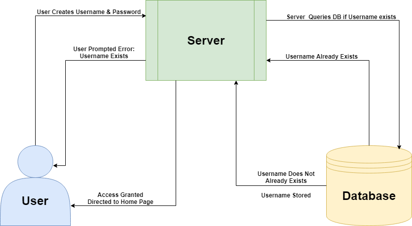
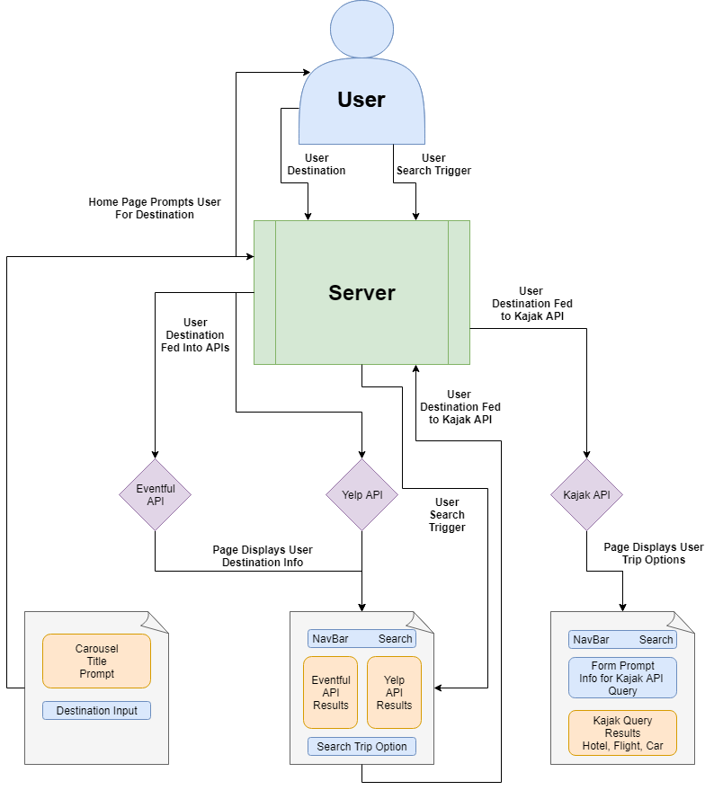

# Project Three
Team Members
Alex Powarzynski, Michael Boslin, David Thayer

# Project Description
User will be able to create a login. Username will be checked against existing usernames in database for duplicates. If duplicate exists user will be prompted with error the the username already exists and request a new username. If no duplicate exists the username and password will be stored in the database for future login.

At the landing page the User will be prompted to enter a destination. The user's destination will then be fed into the first two API's Yelp and Eventful. The results will be loaded to the page for the user to view. Once the user has viewed various events and places to go through the information provided they will have the option to search for trip options i.e. flights, hotel, rental-car through the kajak API.

# Flowchart

# Rough Breakdown of Tasks